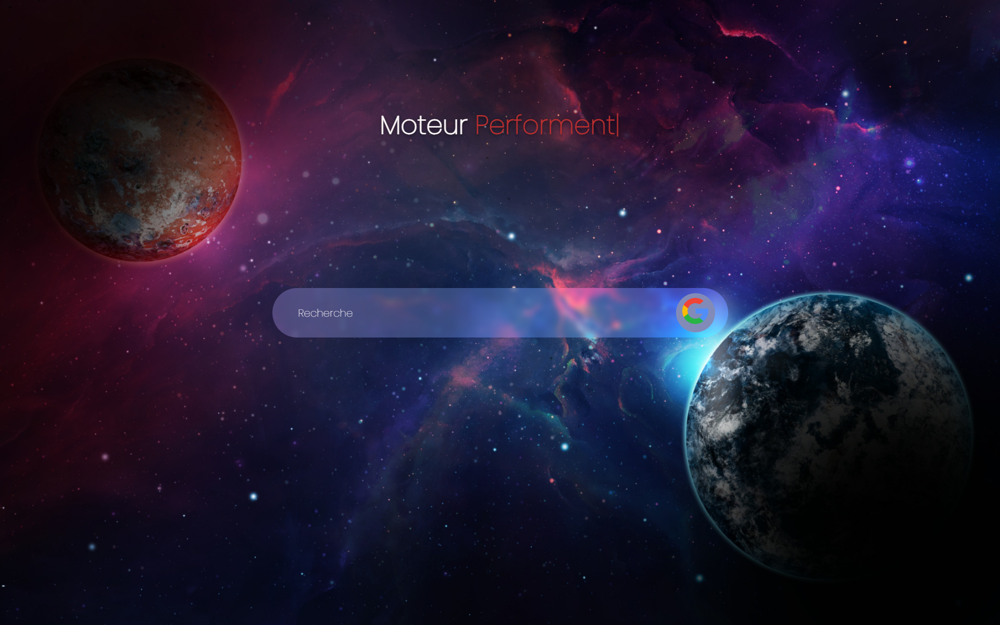

# Moteur-de-recherche

Un moteur de recherche internet simple en HTML, CSS permettant d'effectuer des recherches avec retour.

## Fonctionnalités

- **Chercher internet**
- **Avoir une réponse**

## Technologies utilisées

- **HTML** : Structure de la page
- **CSS** : Design et mise en forme

## Utilisation

1. Saisissez une recherche dans l'encadré de saisis
2. Cliquez sur la touche "Entrée" pour envoyer votre recherche
3. Patienté pour avoir votre réponse !
